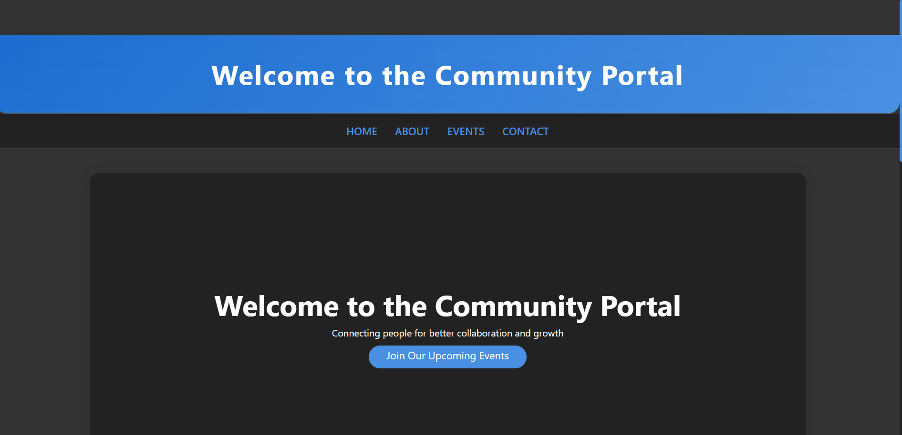
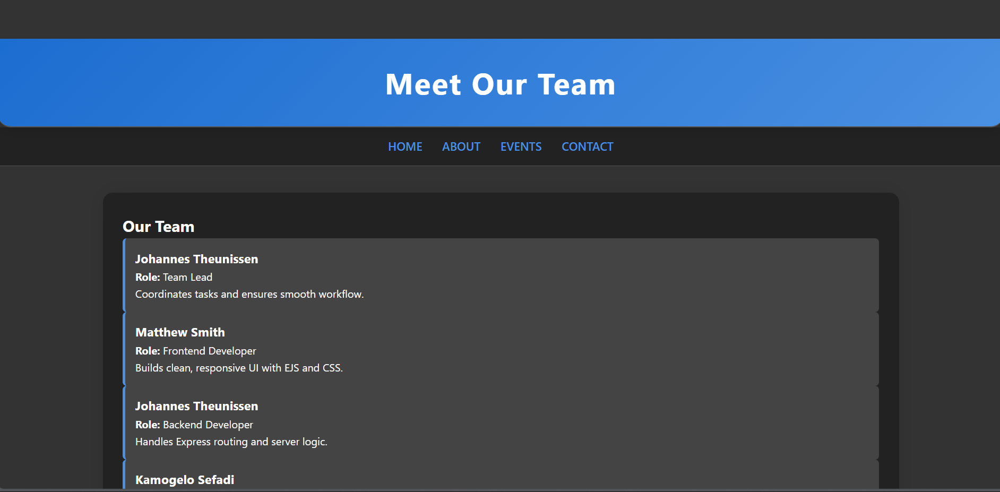
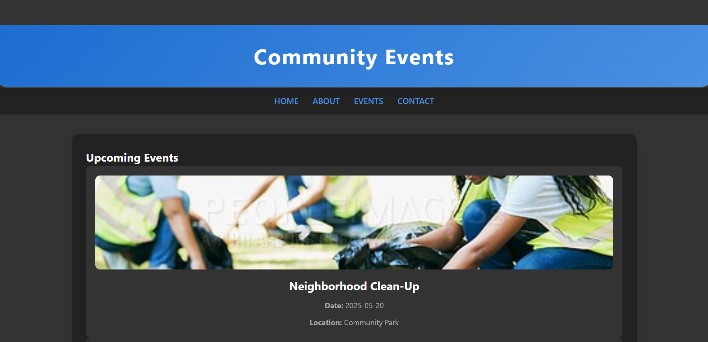
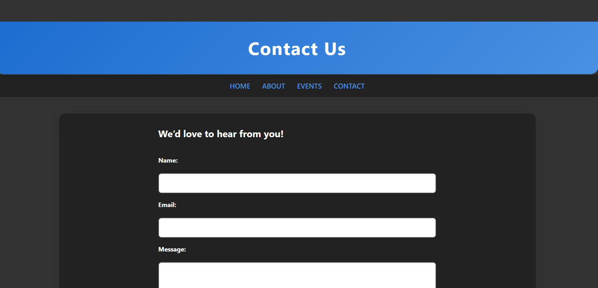

# Community Portal

## Overview

The Community Portal is a web application designed to keep community members informed events and initiatives that takes place within the neighborhood. From here, users are able to discover the various happenings that take place including neighborhood clean-ups, food drives and technology workshops. This website aims to make it easier for residents to engage and participate in local activities. 
The applications is build using Node.js, Express, and the EJS templating engine. The application is simple in design yet very effective for managing users and community events.


## Technologies Used

This project utilizes the following technologies:

* **Node.js:** A JavaScript runtime built on Chrome's V8 JavaScript engine, used for server-side development.
* **Express:** A minimalist and flexible Node.js web application framework providing routing, middleware, and other essential features for building web applications.
* **EJS (Embedded JavaScript templates):** A simple templating engine that allows embedding JavaScript code within HTML templates to generate dynamic web pages for the user interface.
* **npm (Node Package Manager):** The default package manager for Node.js, used for installing and managing project dependencies like Express and EJS.
* **nodemon:** A development dependency that automatically restarts the Node.js application when file changes are detected, improving the development workflow.
* **path (Node.js module):** A core Node.js module used for manipulating file paths, as seen in setting up static directories and views.
* **express.static:** Express middleware used to serve static files such as CSS and images from the `public` directory.
* **express.urlencoded:** Express middleware used to parse incoming request bodies that are URL-encoded, necessary for handling data from HTML forms.
* **CSS (Cascading Style Sheets):** Used for styling the HTML elements and controlling the visual presentation of the web pages, with a `style.css` file located in the `public/css` directory.
* **JPG Images:** A common image format used for static assets within the application, stored in the `public/images` directory.


## Team Members and Roles

* **Johannes Theunissen:** Team Lead & Backend Developer
    * Coordinates tasks and ensures smooth workflow. Handles Express routing and server logic.
* **Matthew Smith:** Frontend Developer
    * Builds clean, responsive UI with EJS and CSS.
* **Kamogelo Sefadi:** Data Manager
    * Manages arrays and handles dynamic rendering.
* **Sandhyaa Budhu:** Documentation Manager
    * Prepares project documentation and README.

## Setup Instructions

To get this Community Portal project running on your local machine, follow these steps:

1.  **Clone the repository:**
    If you haven't already, clone the project repository from your version control system (e.g., GitHub, GitLab). Replace `[repository URL]` with the actual URL of your project's repository and `[project directory name]` with the name of the cloned directory.
    ```bash
    git clone [repository URL]
    cd [project directory name]
    ```

2.  **Navigate to the project directory:**
    Use the `cd` (change directory) command in your terminal to navigate into the project's root directory if you haven't already done so.

3.  **Install dependencies:**
    Run `npm install` in your terminal to install all the necessary Node.js packages listed in the `package.json` file, including `express` and `ejs`. This command will create a `node_modules` directory containing the project's dependencies.

4.  **Start the development server:**
    Use `npm run dev` to start the development server with `nodemon`. This will automatically restart the server whenever you save changes to your project files, which is helpful during development. You should see output in your terminal indicating that the server has started and is likely running on `http://localhost:3000`.

5.  **Start the production server (optional):**
    If you want to run the server in a production-like environment (without automatic restarts), you can use the `start` script defined in `package.json`:
    ```bash
    npm start
    ```
    This will execute the `node app.js` command.

6.  **Open in your web browser:**
    Once the server is running (either with `npm run dev` or `npm start`), open your preferred web browser and navigate to `http://localhost:3000`. You should now be able to see the Community Portal application running locally.

7.  **Add your own route handlers and middleware as needed:**
    As you further develop the application, you will likely need to add more route handlers in your `routes` directory and potentially implement custom middleware in your `app.js` or separate middleware files to handle specific application logic.


## Screenshots







